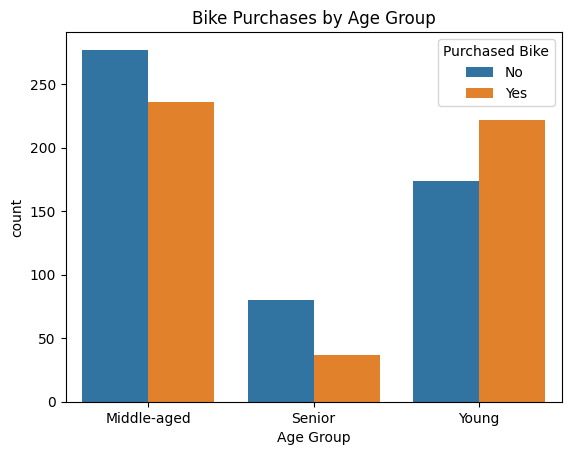
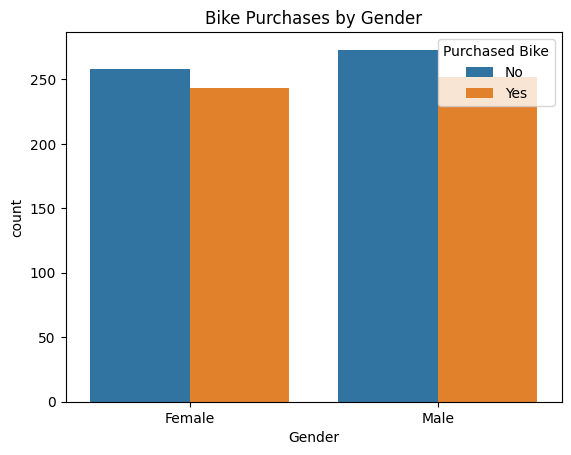
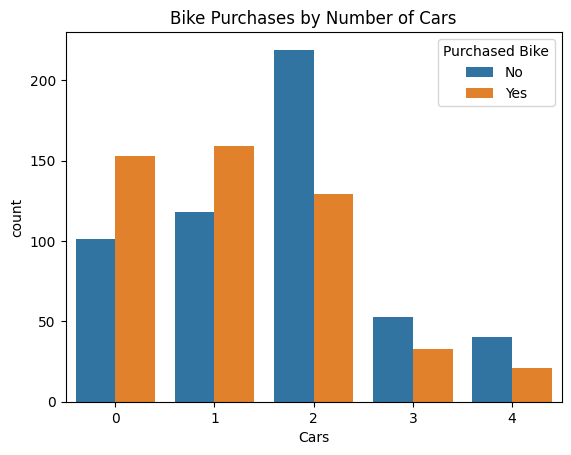
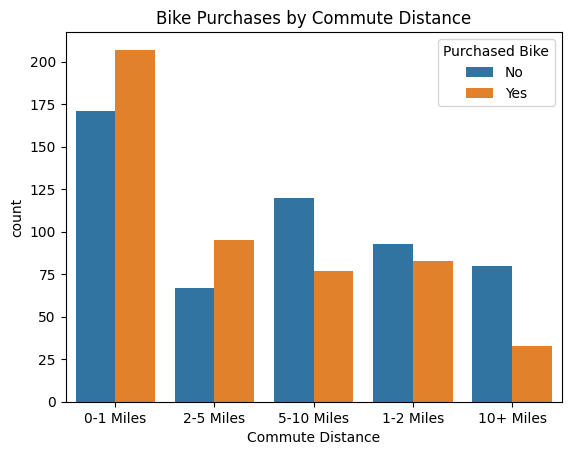
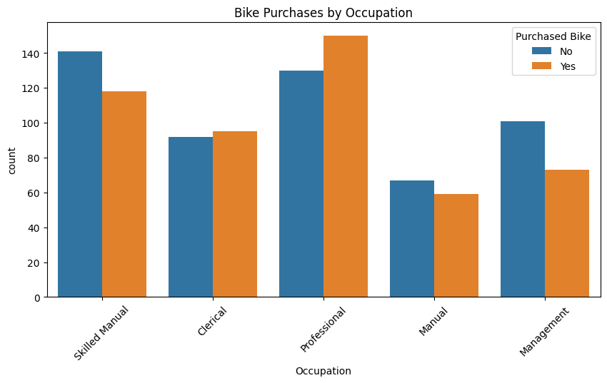

````md
# Bike Sales Analysis 🚴


---

# Project Overview
This project analyzes customer data to understand the factors that influence bike purchases.

The analysis focuses on customer demographics, income, commute distance, occupation, and lifestyle patterns to extract business insights and recommendations.

---

# Objectives
- Understand customer behavior
- Identify factors affecting bike purchases
- Perform exploratory data analysis (EDA)
- Create visualizations
- Generate business insights

---

# Tools & Libraries
- Python
- Pandas
- NumPy
- Matplotlib
- Seaborn
- Jupyter Notebook

---

# Dataset Features
The dataset includes information about:
- Age
- Gender
- Income
- Education
- Occupation
- Commute Distance
- Cars
- Region
- Purchased Bike

---

# Data Cleaning
During the cleaning process:
- Categorical values were standardized
- New feature "Age Group" was created
- Data types were checked
- Missing values were explored

---

# Exploratory Data Analysis (EDA)
The analysis explored:
- Age Group vs Bike Purchase
- Gender vs Bike Purchase
- Income vs Bike Purchase
- Cars vs Bike Purchase
- Commute Distance vs Bike Purchase
- Occupation vs Bike Purchase

---

# Key Insights

## 1. Age Group
Young and middle-aged customers are more likely to purchase bikes, while senior customers show lower purchase behavior.

## 2. Income
Customers who purchased bikes tend to have slightly higher incomes, but income is not the strongest factor.

## 3. Gender
There is no major difference between males and females in bike purchases.

## 4. Commute Distance
Customers with shorter commute distances purchase bikes more frequently.

## 5. Cars
Customers without cars are more likely to purchase bikes.

## 6. Occupation
Some occupations show higher purchase behavior, indicating that lifestyle and job type may influence purchasing decisions.

---

# Business Recommendations
- Target young and middle-aged customers
- Focus marketing campaigns on short-distance commuters
- Promote bikes as an affordable transportation option
- Create targeted campaigns for different occupations
- Focus on customers without cars

---

# Visualizations

## Age Group vs Purchased Bike


---

## Gender vs Purchased Bike


---

## Cars vs Purchased Bike


---

## Commute Distance vs Purchased Bike


---

## Occupation vs Purchased Bike


---

# Project Structure

```bash
bike-sales-analysis/
│
├── data/
│   ├── raw_data.csv
│   └── cleaned_bike_data.csv
│
├── notebooks/
│   └── bike_analysis.ipynb
│
├── images/
│   ├── dashboard_preview.png
│   ├── age_group_chart.png
│   ├── gender_chart.png
│   ├── cars_chart.png
│   ├── commute_chart.png
│   └── occupation_chart.png
│
├── README.md
└── requirements.txt
```

---

# Conclusion
The analysis revealed that age group, commute distance, and car ownership are among the most influential factors affecting bike purchases.

These insights can help businesses create more targeted marketing campaigns and improve customer engagement strategies.

---

# Author
Abdelrahman Ashraf
````
